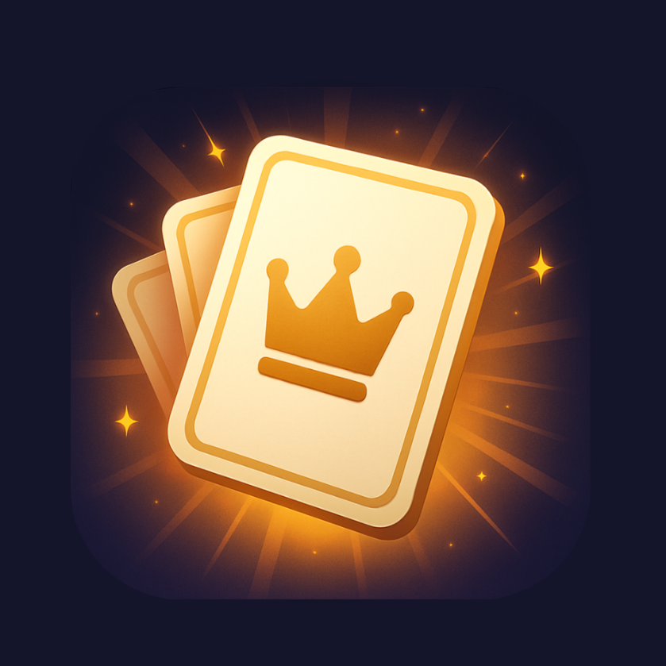

# Rumble!

<table>
  <tr>
    <td align="left" valign="top" width="25%">
      
    </td>
    <td align="left" valign="middle">
      
<b>Rumble!</b> is a mobile party game application designed for local multiplayer gaming. Built from the ground up, the app brings high-energy group dynamics directly to iOS and Android devices without the limitations of a web wrapper. Rumble! combines the core mechanics of popular party games like Heads Up, Catchphrase, and Taboo into a single fluid experience.

      
Players can interact natively using device tilt sensors to pass or score, or use large, high-contrast touch buttons. The app is engineered for quick social setups, featuring robust team management, live scoring, and an open content model that allows hosts to customize, merge, or dynamically pull in new AI-generated word decks on the fly.

      <h3>Core Gameplay & Architecture</h3>
      <ul>
        <li><b>Triple Game-Mode Engine</b>: Play distinct variations including Heads Up (forehead-display with tilt tracking), Catchphrase (fast-paced hot potato), and Taboo (clue-giving with restricted words).</li>
        <li><b>Hardware-Accelerated Interaction</b>: Uses mobile gyroscopes and accelerometers for responsive card flips, alongside a clean, high-contrast UI designed for readability in social settings.</li>
        <li><b>Dynamic Deck Management</b>: Modify existing card sets, hide specific words, add custom text entries, or select and shuffle multiple expansion packs into a single session.</li>
        <li><b>Automated Expansion</b>: Pull downstream pack updates directly via Community Cloud synchronization or generate customized word categories instantly using AI.</li>
      </ul>
    </td>
  </tr>
</table>

---

### System Capabilities

- **Score Validation**: Built-in team tracking with post-round editing to resolve disputed points or accidental passes before committing scores.
- **Hybrid Input Systems**: Full fallback configuration allowing groups to switch instantly between physical tilt motion and traditional touch inputs.
- **Cross-Platform Delivery**: Built specifically for mobile ecosystems ensuring native performance and layout preservation.

---

## Live Release & Instant Updates

### Method 1: Play Directly in Your Browser (iOS & Android)

You can play the game instantly without downloading any external apps or using an App Store. The web version is optimized to run completely full-screen, providing a native app experience on your phone.

**Production URL:** [https://rumble-game.expo.app](https://rumble-game.expo.app)

**How to install on your Home Screen:**

1. Open the production link above on your mobile browser.
2. **On iOS (Safari):** Tap the **Share** button (square with an up arrow) and select **Add to Home Screen**.
3. **On Android (Chrome):** Tap the **Three Dots** menu icon and select **Add to Home screen** or **Install App**.

_This will place a clean app icon on your device home screen, hide the browser address bar, and launch the game in full-screen mode just like a native app._

---

### Method 2: APK Download for Android

Download the pre-compiled `Rumble.apk` file directly from this repository's root directory to install the native application shell manually on your Android hardware.

1. Navigate to the top of this repository and click on the **`Rumble.apk`** file.
2. Click the **Download** button to save the package onto your device.
3. Open the downloaded file on your Android mobile device to begin installation.
4. If prompted, grant your browser or file manager permission to **"Install unknown apps"** in your device system settings to complete the setup.
